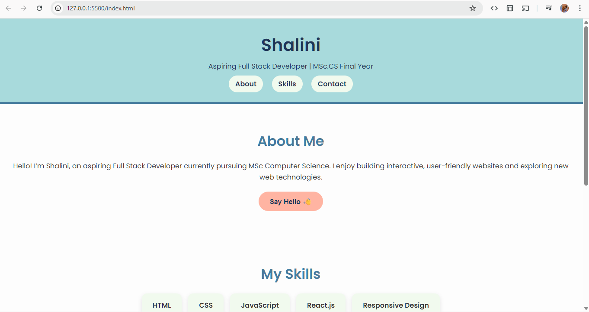

🌸 My Portfolio Website

This is my personal portfolio project, designed and developed using HTML, CSS, and JavaScript.
The goal of this project is to showcase my skills, experience, and contact details in a clean and modern pastel-themed website 🎨.

✨ What I Did in This Project

🎨 Designed a pastel color theme for a soft, modern look

📄 Created sections:

About Me → My introduction and background

Skills → Technologies I have learned

Contact → Email & LinkedIn integration

🔘 Added styled buttons with hover effects

🔗 Linked "Say Hello" button to my LinkedIn for quick contact

📱 Made the layout responsive (works on desktop & mobile)

⚡ Used JavaScript for smooth interactions/navigation

🛠 Tech Stack

🌐 HTML – Structure

🎨 CSS – Styling with pastel colors

⚡ JavaScript – Interactivity

